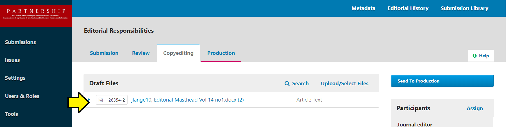

# Overview {.unnumbered}

## Introduction

This documentation is for CJILS Production Managers, Copyeditors, and Layout Editors and gives a detailed description of the roles and responsibilities for each. All production processes are managed through the CJILS OJS instance hosted by the University of Western Ontario. [link](https://ojs.lib.uwo.ca/index.php/cjils/submissions) Currently, we are using OJS 3.3 for this journal. You can reference PKP documentation [here](https://docs.pkp.sfu.ca/learning-ojs/3.3/en/) or a video playlist [here](https://www.youtube.com/watch?v=5Hwkqj4Jvew&list=PLg358gdRUrDUKJbWtr4bgy133_jwoiqoF&index=1). OJS will be updated to 3.5 in mid-October to mid-December of 2026.

Additionally, we use an subscription to Overleaf for formatting the proofs and final versions of each work. You can find the login for our Overleaf account [here](https://www.overleaf.com/project). More details on how to set up each Overleaf project will be included in the Copyediting section below.

Our Google Drive for supporting documents referenced below can be found [here](https://drive.google.com/drive/folders/1aR0qlDHwu-1i6MnpPUo66YAkfg8yHRWn?usp=sharing).

Overall, our workflow starts with the manuscript submission from an author or authors. If selected by the Chief Editor, it will be assigned to the Production Manager to send out requests for peer-review. Upon receiving peer-reviews, the Production Manager sends the reviews or recommendations to the authors. If revisions are required, the authors may resubmit another version for consideration by the Chief Editor who will determine if another round of reviews is necessary. If approved to move forward, the work then enters the Copyediting stage where the Production Manager will assign a CopyEditor. Once the Copyeditor has created a copy for revisions, it is sent to the author for review and comment. If approved, it moves forward to the Layout Editor and a proof is sent to the authors for their approval. Upon approval, the Final Proof is created and then sent to the authors for a final check. Once approved, the work is then scheduled for publication. Below, we have detailed steps for each process.

## Manuscript submission

## Peer-review

## Copyediting

### Copyeditor Role 

The copyeditor:

-   removes redundancies and repetition,

-   ensures compliance with the journal’s bibliographic style,

-    corrects typographic errors, and problems with spelling, punctuation and grammar.

The copyeditor does not change or challenge the substance of the work. If there are concerns about the substance, they should be discussed with the editor before the article is sent back to the author. *Authors and copyeditors share responsibility for correct citations.* While the burden is proportionally on the author, copyeditors should also double check for accuracy, to the best of their ability. Copyeditors may not have access to all sources; if in doubt, flag an item for the author to recheck. Copyeditors liaise directly with the authors about changes to the manuscript. However, if you have any comments or questions that you are unsure of sending to the author, you may contact the Editor for feedback.

#### Workload: 

Our goal is to spread the workload as evenly as possible so you may receive submissions at any point during the year.

#### Basic Production Process: 

1.  The Copyeditor downloads the Draft file and makes copyedits using Track Changes.

2.  The Copyeditor sends the article with revisions back to the author.

3.  The author makes changes and returns the article back to the Copyeditor.

4.  The Copyeditor prepares a clean, edited copy and notifies the Production Editor that it is ready for layout.

5.  The Layout Editor will apply CJILS formatting and prepare a galley.

6.  The proof will be sent to the author for review and returns the article back to the editors.

7.  That proof will be sent to the Proofreader to scan for any copyediting or formatting errors and returns the article back to the editors.

8.  The Layout Editor then makes any changes, prepares metadata, and prepares accessibility features.

9.  The article is ready for publication.

#### Production Timeline: 

The table below shows the production timeline for each article. For most submissions, the initial copyedit, final copyedit and final proofread should be completed and returned within two weeks. The timeline below also applies to the authors’ copyedits and proofreading (unless there are particularly substantial changes; defer to the Editor if you have any questions).

+:-----------:+:----------:+:-----------:+:---------:+:------------:+:------------:+
| Copyedit 1  | Author CE  | Copyedit 2  | Layout    | Author Proof | Final Proof  |
|             |            |             |           |              |              |
| (2 weeks)   | (2 week)   | (2 week)    | (2 weeks) | (1 week)     | (2 weeks)\|  |
+-------------+------------+-------------+-----------+--------------+--------------+

If you believe you will be unable to complete a submission in the usual time frame, please contact the Production Editor to let them know. Depending on your availability, the timeline may either be adjusted or reassigned to another copyeditor.

#### Copyeditor Tasks and Workflow in OJS

The copyediting stage is intended to improve the readability of the writing: flow, clarity, grammar, wording, and formatting. It also represents the last chance for the author to make substantial changes to the text, as the next stage is restricted to typos and formatting corrections. Refer to the [Copyeditor Tasks and Workflow in OJS](https://docs.google.com/document/d/19o-7MyR_FIM1vs5Js6WrbJiG06f9X8-wqFh-cy76k6k/edit?usp=sharing) for instructions on downloading/uploading files and communicating with authors and editors during the copyediting process.

## Initial Copyedit

-   Locate the file to be copyedited in “Draft files”

{fig-alt="Screenshot of the CJILS OJS" fig-align="center"}

-   Open the file.

-   Complete the initial copyedit using Track Changes. 

-   You are now ready to request that the author complete the Author Copyedit.

...

#### Copyediting and Style Guide 

Copyeditors and Proofreaders use the provided [CJILS Copyediting and Style Guide](https://drive.google.com/file/d/15KeJ4oJdu91atUYUJaa8CY6IwqeSSK38/view?usp=sharing) document for instructions on how to edit and style the articles. We ask that you follow this closely and complete the copyediting checklist.

#### Copyediting with Microsoft Word's Track Changes 

Track Changes (under Tools in the menu bar) enables the copyeditor to make insertions (text appears in color) and deletions (text appears crossed out in color or in the margins as deleted). You can insert comments to ask for clarification or make suggestions. The author should leave those changes with which they are satisfied. If further changes are necessary, the author can make changes to the initial insertions or deletions, as well as make new insertions or deletions elsewhere in the text. After the text has been reviewed by the author, the copyeditor will make a final pass over the text accepting the changes in preparation for the layout and galley stage. The copyeditor’s final copy should be a clean copy, free of any comments or track changes.

#### Additional sections and links to add:

-   Notifying a copyeditor;

-   emailing through CJILS copyeding group in the Dal MS mail;

-   assigning by tiers; French vs English versions;

-   responsibilities of the copyeditor;

-   uploading last draft from the copyeditor

-   discussions between copyeditor and author

-   approving copyedited version, sending to production

## Proofreading

The proofreading stage is intended to catch any errors in spelling, grammar, punctuation, and formatting. More substantial changes cannot be made at this stage, unless discussed with the Editor.

### Tasks and Workflow in OJS 

The Proofreader will be sent the proof via the Production Discussions panel by the Production Editor. To download the article, open the discussion and download the attachment. To send back with any changes, use “Add Message” in the discussion to attach the file and send back to the editors.

#### Copyediting/Style Guide and Layout 

Proofreaders also use the provided [CJILS Copyediting and Style Guide](https://drive.google.com/file/d/15KeJ4oJdu91atUYUJaa8CY6IwqeSSK38/view?usp=sharing) document for instructions on how to edit and style the articles. Proofreaders also use the Layout documents to proofread the formatting and layout of the articles.

#### For Spelling, Grammar, and Style Errors 

Use the comments tool in Adobe to request corrections. Provide "CHANGE-TO" instructions to the editor as follows. Highlight the text in question and provide instructions such as:

1.  CHANGE... then the others TO... than the others

2.  CHANGE... Malinowsky TO... Malinowski

#### For Formatting Errors 

Use the comments tool in Adobe to request corrections. Provide "FORMATTING" instructions to the editor as follows:

1.  FORMATTING The numbers in Table 3 are not aligned in the third column.

2.  FORMATTING The paragraph that begins "This last topic..." is not indented.

## Production

From OJS 3.5...

### 

## Publication

From OJS 3.5...